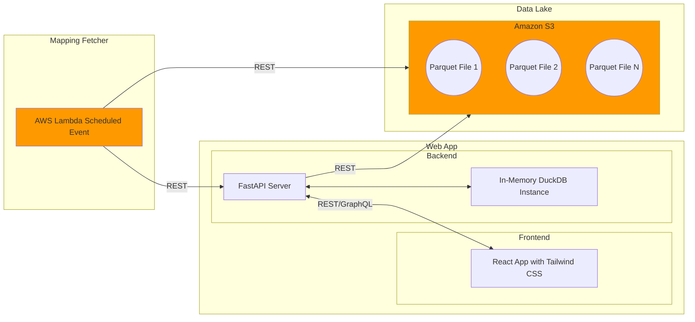

# NUSRoaming

### Architecture

```mermaid
graph LR

    subgraph Web App

        subgraph Frontend
            FE[React App with Tailwind CSS]
        end

        subgraph Backend
            BE[FastAPI Server]
            DB[In-Memory DuckDB Instance]
            BE <--> DB
        end
    end

    subgraph Data Lake
        %% DL[Data Lakehouse - DuckDB Parquet Files]
        subgraph S3[Amazon S3]
            P1((Parquet File 1))
            P2((Parquet File 2))
            P3((Parquet File N))
        end
    end

    subgraph Mapping Fetcher
        DU[AWS Lambda Scheduled Event]
    end

    BE <-->|REST/GraphQL| FE
    BE -->|REST| S3
    DU -->|REST| S3
    DU -->|REST| BE

    classDef aws fill:#FF9900
    class S3,DU aws
```