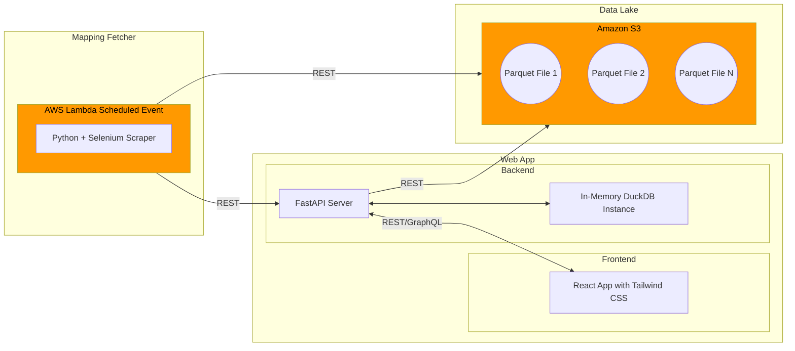

# NUSRoaming

## Usage

#### Frontend
```bash
cd frontend
npm install
npx next dev
```

The frontend app will now be served on `http://localhost:3000`

#### Backend
```bash
cd backend
pip3 install -r requirements.txt
python3 server.py
```

The backend app will now be served on `http://localhost:8000`. You can access Swagger documentation via `http://localhost:8000/docs`.

## Dev Install
For developers, linters, PyTest, and pre-commit hooks can be installed via
```bash
cd backend
pip3 install -r requirements-dev.txt
pre-commit install
```

All pre-commit checks can be manually run via
```bash
pre-commit run --all-files
```
They will also be run each time you attempt to commit a change.

## Architecture


